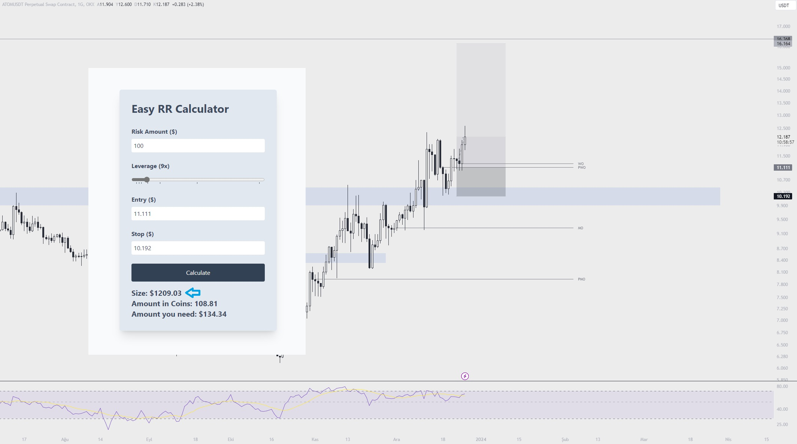

# Easy RR Calculator

## You can easily calculate your risk/reward with this tool.

Set your risk, leverage, entry and stop then tool will calculate your position size.

For perpetual trades, the most important thing is knowing and setting how much you can afford to lose per trade. This tool prioritizes this.
In this image, you are risking $100 for this trade. You will lose $100 if your stop loss gets triggered. If price hits your TP, you will win ($100 \* YourRR) amount.
